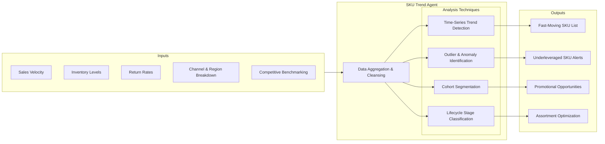
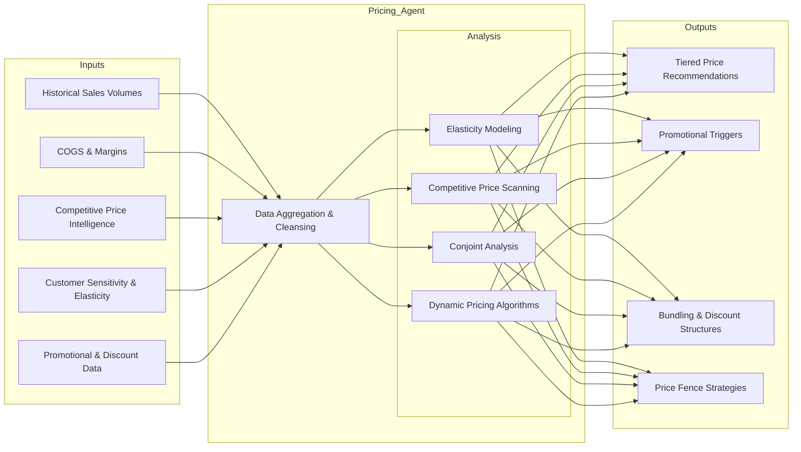
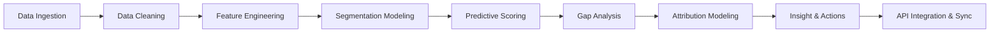
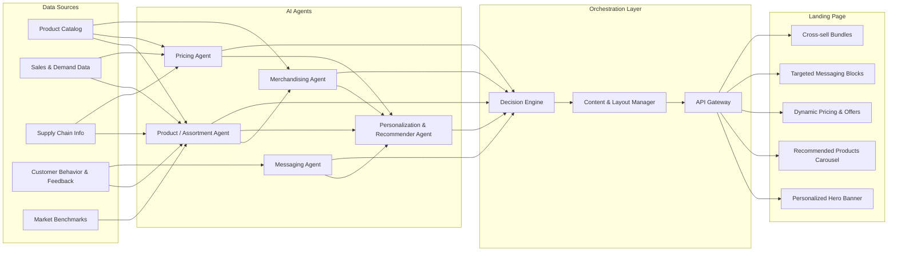

## Sales
---


## Price
---

## Marketing
---


## Messaging
---
```mermaid
flowchart TB
  subgraph Data Inputs
    A[Creative Performance Metrics]
    B[Customer Persona Profiles]
    C[A/B & Multivariate Test Results]
    D[Social Listening & Sentiment Analysis]
    E[Competitive Creative Libraries]
  end

  subgraph Analysis Techniques
    F[Messaging Performance Analysis]
    G[A/B & Multivariate Testing]
    H[Sentiment & Trend Mining]
    I[Persona Alignment Scoring]
  end

  subgraph Outputs & Actions
    J[Top Performing Hooks]
    K[Persona Messaging Frameworks]
    L[Channel-Specific Creative Formats]
    M[Occasion & Seasonality Themes]
  end

  A --> F
  B --> I
  C --> G
  D --> H
  E --> F

  F --> N[Aggregate Insights]
  G --> N
  H --> N
  I --> N

  N --> J
  N --> K
  N --> L
  N --> M
  ```

## Product/Assortment Agent
---
```mermaid
flowchart LR
  subgraph Inputs
    A[Product Catalog Metadata]
    B[Historical Sales & Demand Signals]
    C[Supply Chain Constraints]
    D[Consumer Feedback]
    E[Competitive Assortment Benchmarks]
  end

  subgraph Ingestion
    F[Data Extraction & Cleansing]
    G[Feature Engineering]
  end

  subgraph Analysis
    H[Demand Forecasting]
    I[ABC/XYZ Classification]
    J[Attribute Preference Modeling]
    K[Cannibalization & Complementarity Analysis]
  end

  subgraph Outputs
    L[Assortment Prioritization List]
    M[Out-of-Stock Risk Alerts]
    N[Rationalization Suggestions]
    O[Bundle & Cross-Sell Ideas]
  end

  subgraph Integration & Feedback Loop
    P[ERP/PIM Sync]
    Q[Dashboard Alerts to Merchandisers]
    R[Model Retraining]
  end

  %% Data flow arrows
  A --> F
  B --> F
  C --> F
  D --> F
  E --> F

  F --> G

  G --> H
  G --> I
  G --> J
  G --> K

  H --> L
  I --> L
  J --> L
  K --> L

  H --> M
  I --> N
  K --> O

  L --> P
  M --> Q
  N --> Q
  O --> Q

  P --> R
  Q --> R
  R --> F
```

## Complete flow
---

